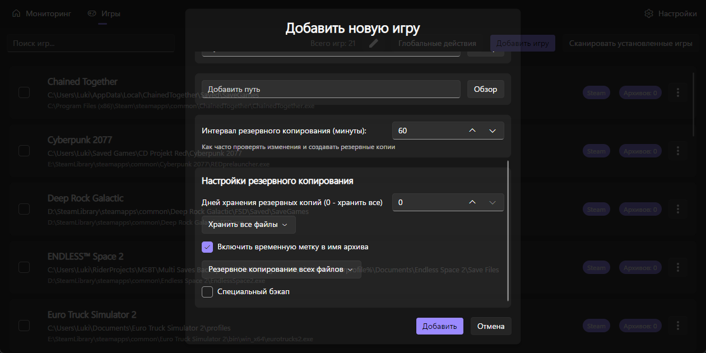

# Как мне добавить игру?

<figure><figcaption></figcaption></figure>

Перейдите на вкладку Игры и нажмите на кнопку Добавить игру.\

<figure><figcaption></figcaption></figure> <figure><figcaption></figcaption></figure>

Здесь нужно обязательно указать название игры, exe-файл игры и путь к сохранениям.

Затем нажмите на кнопку Добавить.

## Игра добавлена!
