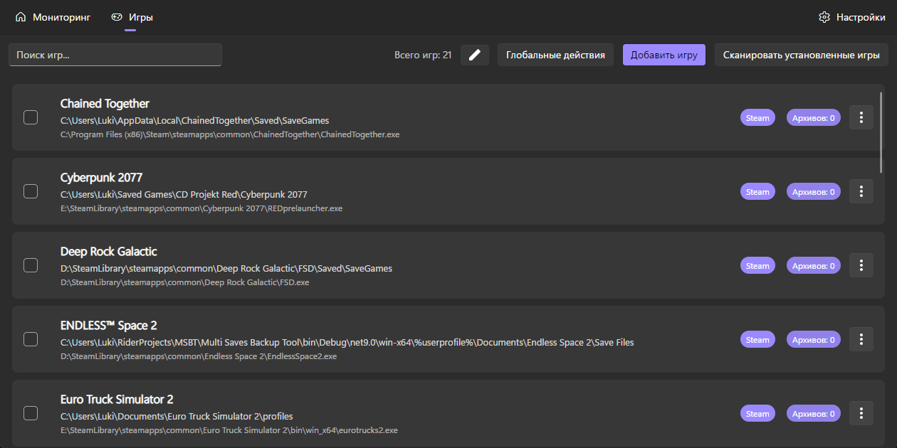
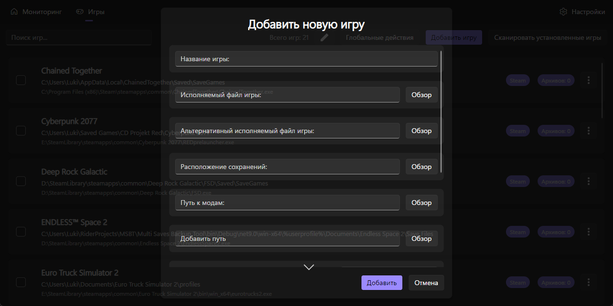
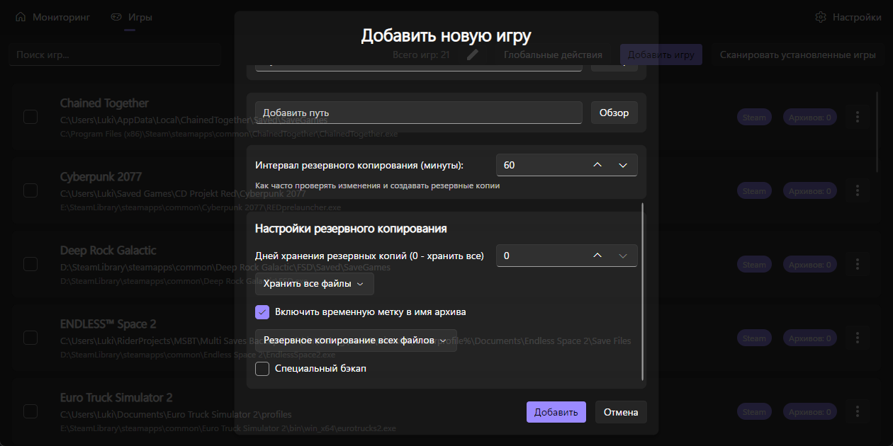

# Как мне добавить игру?

Перейдите на вкладку Игры и нажмите на кнопку Добавить игру.\

Здесь нужно обязательно указать название игры, exe-файл игры и путь к сохранениям.

Затем нажмите на кнопку Добавить.

## Игра добавлена!
