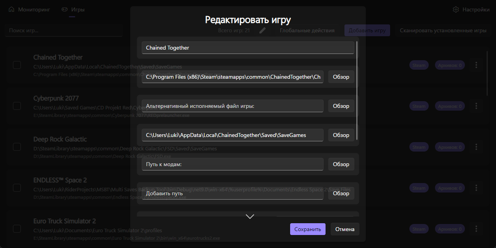

## Общие настройки

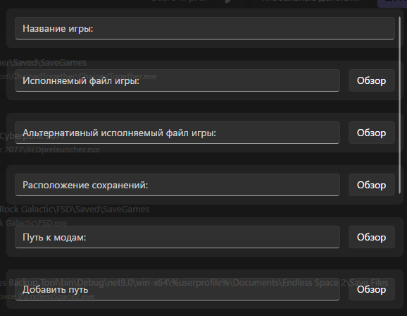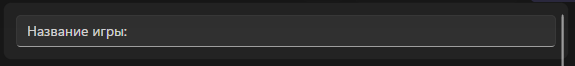

Название игры должно содержать название игры.

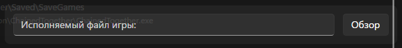

Исполняемый файл игры должен содержать путь к exe-файлу игры.

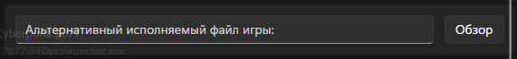

Альтернативный исполняемый файл игры должен содержать альтернативный путь к exe-файлу игры.

Расположение сохранений должно содержать путь к папке сохранения игры.

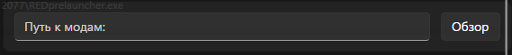

Путь к модам содержит путь к папке модов игры.

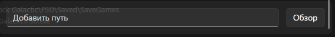

Дополнительные пути должны содержать дополнительные пути.

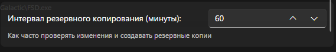

Интервал резервного копирования - это интервал между резервными копиями. Не более 1440 минут и не менее 1 минуты.

## Настройки резервного копирования

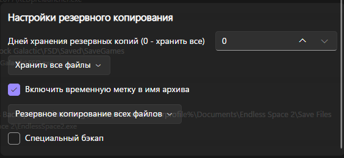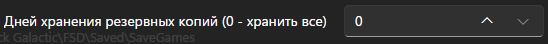

Дни хранения резервных копий должны содержать дни, в течение которых резервные копии должны храниться перед удалением.

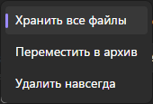

Этот пункт должен содержать информацию о том, что делать с резервными копиями, срок хранения которых истек. Сохранить все. Переместить их в архив. Удалить навсегда.

Требуется ли сохранять временную метку в имени архива.

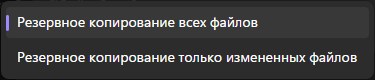

Следующий пункт позволяет настроить, что делать с сохраненными файлами. Сохранять все или только измененные файлы.

Специальное резервное копирование перемещает каталоги, содержащие дату в имени (после дефиса, формат YYMMDD), из исходной папки (%SavePath%) в архивную папку (%SaveArchivePathTemp%%%GameName%), если их дата старше вчерашней. Перемещение не выполняется, если все каталоги имеют одинаковую дату.
