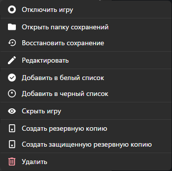

# Управление игрой

Отключить игру, предотвратить запуск резервного копирования.

Открыть папку сохранения - открыть директорию, в которой хранятся файлы сохранения игры.

Восстановить резервную копию - возврат игры к ранее сохраненному состоянию резервной копии.

Редактировать, позволяет изменять настройки игры.

Добавить в белый список - добавление игры в список одобренных или доверенных приложений.

Добавить в черный список - добавить игру в список ограниченных или заблокированных приложений.

Скрыть игру - скрыть игру от посторонних глаз в интерфейсе или системе.

Создать резервную копию - создание копии текущих данных игры для хранения.

Создать защищенную резервную копию - создание безопасной копии игровых данных с дополнительной защитой.

Удалить - окончательное удаление игры и связанных с ней данных.
