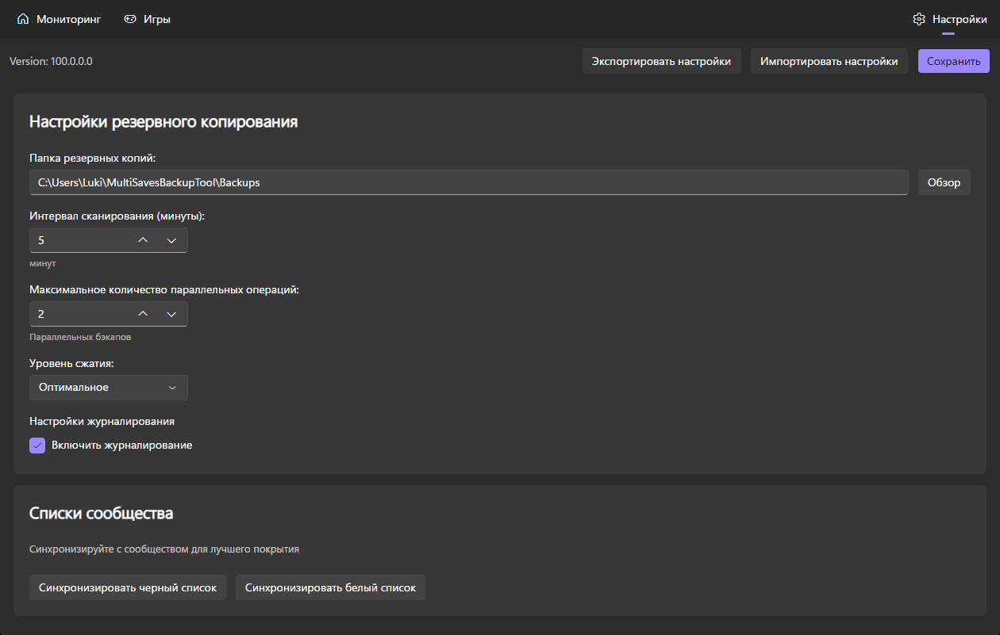

# Вкладка Настройки

Содержит настройки резервного копирования. Путь к папке с резервными копиями, интервал сканирования, максимальное количество параллельных резервных копий, уровень сжатия и ведение журнала.

Внизу есть кнопки для синхронизации с сервером сообщества.
