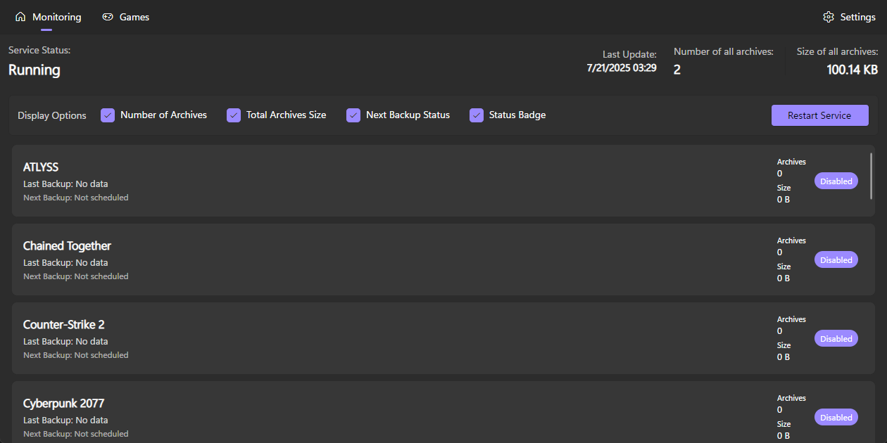

# Monitoring Tab

<figure><figcaption></figcaption></figure>

It contains information about the status of the service, the last update of the service, the number of archives and the size of the archives.\
You can disable some parameters from the screen, as well as restart the service.

The section at the bottom says game, last backup, next backup, number of archives, size of archives, and game state status.
