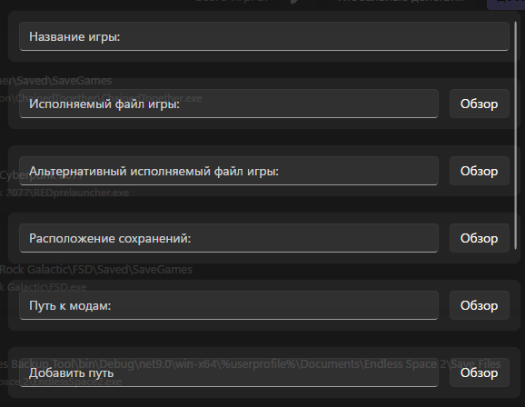
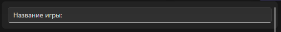
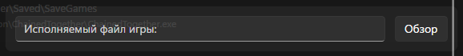
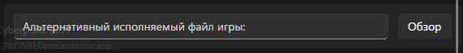
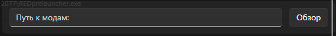
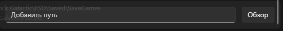
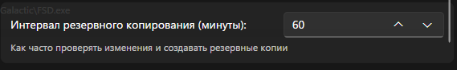
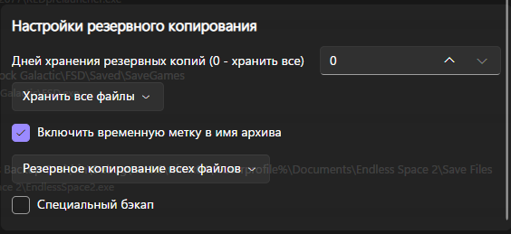
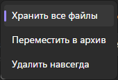
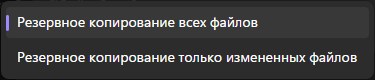

# Добавить/редактировать игру

<figure><figcaption></figcaption></figure> <figure><figcaption></figcaption></figure>

## Общие настройки

<figure><figcaption></figcaption></figure>

<figure><figcaption></figcaption></figure>

Название игры должно содержать название игры.

<figure><figcaption></figcaption></figure>

Исполняемый файл игры должен содержать путь к exe-файлу игры.

<figure><figcaption></figcaption></figure>

Альтернативный исполняемый файл игры должен содержать альтернативный путь к exe-файлу игры.

<figure><figcaption></figcaption></figure>

Расположение сохранений должно содержать путь к папке сохранения игры.

<figure><figcaption></figcaption></figure>

Путь к модам содержит путь к папке модов игры.

<figure><figcaption></figcaption></figure>

Дополнительные пути должны содержать дополнительные пути.

<figure><figcaption></figcaption></figure>

Интервал резервного копирования - это интервал между резервными копиями. Не более 1440 минут и не менее 1 минуты.

## Настройки резервного копирования

<figure><figcaption></figcaption></figure>

<figure><figcaption></figcaption></figure>

Дни хранения резервных копий должны содержать дни, в течение которых резервные копии должны храниться перед удалением.

<figure><figcaption></figcaption></figure>

Этот пункт должен содержать информацию о том, что делать с резервными копиями, срок хранения которых истек. Сохранить все. Переместить их в архив. Удалить навсегда.

<figure><figcaption></figcaption></figure>

Требуется ли сохранять временную метку в имени архива.

<figure><figcaption></figcaption></figure>

Следующий пункт позволяет настроить, что делать с сохраненными файлами. Сохранять все или только измененные файлы.

<figure><figcaption></figcaption></figure>

Специальное резервное копирование перемещает каталоги, содержащие дату в имени (после дефиса, формат YYMMDD), из исходной папки (%SavePath%) в архивную папку (%SaveArchivePathTemp%%%GameName%), если их дата старше вчерашней. Перемещение не выполняется, если все каталоги имеют одинаковую дату.
